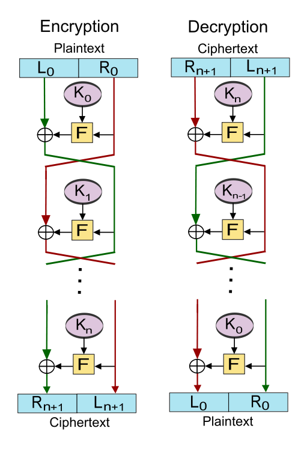

# E-DES (*Enhanced Data Encryption Standard*)

## Objetivo
 - Este projeto é uma modificação do algoritmo DES. 
 - Esta variante utiliza menos operações do que o algoritmo DES original.
 - Utiliza apenas as redes Feistel e as S-Boxes para a cifragem e decifragem dados.
 - As aplicações devem processar a entrada a partir de `stdin` e produzir um resultado para `stdout`. 
 - O E-DES (ou DES) deve ser utilizado para processar a entrada no modo ECB com um *padding* PKCS#7.
 - A geração de S-Boxes é feita através de uma palavra-passe textual, implementação ao critério do grupo.
 - Cada valor das S-Boxes existe 16 vezes, pode ser encontrados na mesma ou em S-Boxes diferentes.

## Implementação e Desenvolvimento
Neste capítulo, irá ser abordado o processo de implementação e desenvolvimento do projeto de criptografia com base nas especificações detalhadas anteriormente. Abordaremos a tradução de conceitos teóricos em código prático, explicando como cada componente é efetivamente implementado

### Especificações do Projeto
- Tamanho do Bloco: `64 bits` (8 bytes).
- Chave de gerada pela palavra-passe: `256 bits` (32 bytes).
- Número Rondas: `16`.
- Número S-Boxes: `16`.
- Tamanho da S-Box: `256` bytes.

### PKCS#7 *Padding*
*Padding* é um processo usado em criptografia e processamento de dados para **ajustar o tamanho** de um bloco de dados, geralmente em formato binário, a um tamanho específico. Isso é necessário quando algoritmos criptográficos operam em blocos de **tamanho fixo**, e os dados de entrada não preenchem o bloco inteiramente. 

O PKCS#7 é um esquema de preenchimento amplamente utilizado, funciona da seguinte forma:
1. Se o tamanho do mensagem for múltiplo do tamanho do bloco, então é adicionado um bloco de bytes com o valor do tamanho do bloco.
2. Se o tamanho do mensagem não for múltiplo do tamanho do bloco, então é adicionado um bloco de bytes com o valor da diferença entre o tamanho do bloco e o tamanho da mensagem.


### Redes Feistel
Uma das mais bem sucedidas cifras de chave simétrica por blocos é o DES. O núcleo desta cifra é constituído por redes de feistel, que são funções sempre invertíveis, mas construidas a partir de funções não invertíveis. As redes feistel são, na verdade, uma forma bastante engenhosa de construir PRPs (permutações pseudo-aleatórias) a partir de PRFs (funções pseudo-aleatórias).

Para a **cifragem** o algoritmo funciona da seguinte forma:
1. Divide o bloco de dados em duas metades (L e R).
2. Aplica uma função de transformação `f` na metade direita (R) do bloco.
3. Aplica uma função XOR entre a metade esquerda (L) e a metade direita (R) do bloco.
4. Troca as metades do bloco (a metade esquerda passa para a direita inalterada).
5. Repete o processo até que todas as rondas sejam executadas.

Para a **decifragem** o algoritmo funciona da seguinte forma:
1. Divide o bloco de dados em duas metades (L e R).
2. Aplica uma função de transformação `f` na metade esquerda (L) do bloco.
3. Aplica uma função XOR entre a metade esquerda (L) e a metade direita (R) do bloco.
4. Troca as metades do bloco (a metade direita passa para a esquerda inalterada).
5. Repete o processo até que todas as rondas sejam executadas.



Mais que isso, um teorema de **Luby–Rackoff**, de 1985, assegura que qualquer rede de Feistel com mais do que **3 rondas** construída a partir de PRFs seguras define um **PRP seguro**, se a função de transformação `f` for uma PRF segura. O DES especifica **16 rondas**, enquanto que o 3DES especifica **48 rondas**.

### Função de Transformação `f`
A função de transformação `f` é uma função que recebe como entrada um bloco de 4 bytes e produz como saída um bloco de 4 bytes. Esta função é composta por o uso de S-boxes, operação essa que dá **difusão** aos dados de entrada (alteram a estatística dos dados).

A função de transformação `f` é a seguinte:
1. Pega num bloco de 4 bytes, e divide-o em 4 blocos de 1 byte.
2. O primeiro bloco de memória (offset 0) será o valor da S-Box no indíce do último bloco de memória (offset 3).
3. O segundo bloco de memória (offset 1) será o valor da S-Box no indíce do XOR entre o último bloco de memória (offset 3) e o penúltimo bloco de memória (offset 2).
4. O terceiro bloco de memória (offset 2) será o valor da S-Box no indíce do XOR entre o penúltimo bloco de memória (offset 2) e o ante-penultimo bloco de memória (offset 1).
5. O quarto bloco de memória (offset 3) será o valor da S-Box no indíce do XOR entre o ante-penultimo bloco de memória (offset 1) e o primeiro bloco de memória (offset 0).


Exemplo de uma função de transformação `f` em `C`:
```c
uint8_t SBox [256];
uint8_t in [4];
uint8_t out [4];

uint8_t index = in[3];
out[0] = SBox[index];

index = (index + in[2]);
out[1] = SBox[index];

index = (index + in[1]);
out[2] = SBox[index];

index = (index + in[0]);
out[3] = SBox[index];
```

### Tabelas de Substituição (S-Boxes)
As S-Boxes são tabelas de substituição que transformam valores de entrada em valores de saída de maneira não linear. As S-boxes servem para tornar as relações entre os bits dos dados de entrada e saída complicadas, tornando a criptografia mais robusta contra ataques como a análise diferencial e a análise linear.

#### Geração da S-Box inicial
A S-Box inicial é gerada a partir de uma palavra-passe textual, que é convertida para uma chave de 256 bits (32 bytes) usando a função de hash SHA-256. É obtido o primeiro byte da chave, adicionado à S-Box e é feito a função da chave anterior, este processo é repetido até que a S-Box esteja completa.

```
S-Box[0] = Hash(palavra-passe)[0]
```

Após a geração da S-Box inicial, é replicado esses mesmos 256 bytes para uma lista 16 vezes (16 S-Boxes).

#### Round-robin Shuffle
O Round-robin é um algoritmo de embaralhamento que é usado para mistura os elementos de uma lista de maneira uniforme. 

O algoritmo funciona da seguinte forma:
1. É inicializado o valor do `shift` com 1.
2. Para cada elemento da nova lista, é feito um `shift` para a esquerda com o valor do `shift` atual.
3. O `shift` é incrementado em 1, caso o valor do mesmo seja igual ou superior ao tamanho da lista é feito um reset do `shift` para 1.
4. Repete o processo até que todos os elementos da lista sejam embaralhados.

Este algoritmo é usado para embaralhar as S-Boxes geradas anteriormente adicionando uma pseudo-aleatoriedade ao algoritmo e adicionando **confusão** ao mesmo (não existe relação baixa entre a chave, o texto em claro e o texto cifrado).


## Compilação e Execução do Projeto

### Em C

Para **compilar**, basta executar o makefile:
```console
$ make
```

Para **limpar** os ficheiros gerados pelo makefile, basta executar o seguinte comando:
```console
$ make clean
```

Para **cifrar**, basta executar o seguinte comando:
```console
$ ./e-des -e <palavra-passe>
```

Depois é só usar o `stdin` para inserir o texto a cifrar e o `stdout` para obter o texto cifrado.


Para **decifrar**, basta executar o seguinte comando:
```console
$ ./e-des -d <palavra-passe>
```

Depois é só usar o `stdin` para inserir o texto a decifrar e o `stdout` para obter o texto decifrado.

Para **testar** a performance do algoritmo, basta executar o seguinte comando:
```console
$ ./speed
```

### Em Python

Para **cifrar**, basta executar o seguinte comando:
```console
$ python3 e_des.py -e -p <palavra-passe>
```

Depois é só usar o `stdin` para inserir o texto a cifrar e o `stdout` para obter o texto cifrado.

Para **decifrar**, basta executar o seguinte comando:
```console
$ python3 e_des.py -d -p <palavra-passe>
```

Depois é só usar o `stdin` para inserir o texto a decifrar e o `stdout` para obter o texto decifrado.


Para **testar** a performance do algoritmo, basta executar o seguinte comando:
```console
$ python3 speed.py
```


#### Doxygen

Para **gerar** a documentação do projeto, basta executar o seguinte comando:
```console
$ doxygen Doxyfile
```

## Testes e desempenho

### Testes Unitários para as S-Boxes
Input de teste em `C`:
```c
    uint64_t input_test_block = {
        01, 00, 00, 00, 00, 00, 00, 00,
        00, 01, 00, 00, 00, 00, 00, 00,
        00, 00, 01, 00, 00, 00, 00, 00,
        00, 00, 00, 01, 00, 00, 00, 00,
        00, 00, 00, 00, 01, 00, 00, 00,
        00, 00, 00, 00, 00, 01, 00, 00,
        00, 00, 00, 00, 00, 00, 01, 00,
        00, 00, 00, 00, 00, 00, 00, 01};
```

Output de teste em `C`:
```c
    uint64_t output_test_block[] = {
        0x3c, 0x58, 0x2b, 0x44, 0x04, 0x4b, 0x5f, 0x1c,
        0x3d, 0x55, 0x20, 0x41, 0x06, 0x4e, 0x69, 0x64,
        0x3d, 0x59, 0x2b, 0x47, 0x05, 0x45, 0x58, 0x19,
        0x3c, 0x5b, 0x21, 0x43, 0x07, 0x4c, 0x6c, 0x63,
        0x3a, 0x53, 0x19, 0x48, 0x0c, 0x6a, 0x60, 0x7c,
        0x3f, 0x15, 0x18, 0x62, 0x1d, 0x0c, 0x7f, 0x62,
        0x3e, 0x28, 0x12, 0x7e, 0x12, 0x7a, 0x63, 0x7c,
        0x02, 0x6d, 0x16, 0x4b, 0x0d, 0x6a, 0x26, 0x6c};
```
S-boxes de teste em `C`:
```c

    uint8_t SBox_01[] = {
        0x00, 0x00, 0x01, 0x01, 0x02, 0x02, 0x03, 0x03, 0x04, 0x04, 0x05, 0x05, 0x06, 0x06, 0x07, 0x07,
        0x08, 0x08, 0x09, 0x09, 0x0a, 0x0a, 0x0b, 0x0b, 0x0c, 0x0c, 0x0d, 0x0d, 0x0e, 0x0e, 0x0f, 0x0f,
        0x10, 0x10, 0x11, 0x11, 0x12, 0x12, 0x13, 0x13, 0x14, 0x14, 0x15, 0x15, 0x16, 0x16, 0x17, 0x17,
        0x18, 0x18, 0x19, 0x19, 0x1a, 0x1a, 0x1b, 0x1b, 0x1c, 0x1c, 0x1d, 0x1d, 0x1e, 0x1e, 0x1f, 0x1f,
        0x20, 0x20, 0x21, 0x21, 0x22, 0x22, 0x23, 0x23, 0x24, 0x24, 0x25, 0x25, 0x26, 0x26, 0x27, 0x27,
        0x28, 0x28, 0x29, 0x29, 0x2a, 0x2a, 0x2b, 0x2b, 0x2c, 0x2c, 0x2d, 0x2d, 0x2e, 0x2e, 0x2f, 0x2f,
        0x30, 0x30, 0x31, 0x31, 0x32, 0x32, 0x33, 0x33, 0x34, 0x34, 0x35, 0x35, 0x36, 0x36, 0x37, 0x37,
        0x38, 0x38, 0x39, 0x39, 0x3a, 0x3a, 0x3b, 0x3b, 0x3c, 0x3c, 0x3d, 0x3d, 0x3e, 0x3e, 0x3f, 0x3f,
        0x40, 0x40, 0x41, 0x41, 0x42, 0x42, 0x43, 0x43, 0x44, 0x44, 0x45, 0x45, 0x46, 0x46, 0x47, 0x47,
        0x48, 0x48, 0x49, 0x49, 0x4a, 0x4a, 0x4b, 0x4b, 0x4c, 0x4c, 0x4d, 0x4d, 0x4e, 0x4e, 0x4f, 0x4f,
        0x50, 0x50, 0x51, 0x51, 0x52, 0x52, 0x53, 0x53, 0x54, 0x54, 0x55, 0x55, 0x56, 0x56, 0x57, 0x57,
        0x58, 0x58, 0x59, 0x59, 0x5a, 0x5a, 0x5b, 0x5b, 0x5c, 0x5c, 0x5d, 0x5d, 0x5e, 0x5e, 0x5f, 0x5f,
        0x60, 0x60, 0x61, 0x61, 0x62, 0x62, 0x63, 0x63, 0x64, 0x64, 0x65, 0x65, 0x66, 0x66, 0x67, 0x67,
        0x68, 0x68, 0x69, 0x69, 0x6a, 0x6a, 0x6b, 0x6b, 0x6c, 0x6c, 0x6d, 0x6d, 0x6e, 0x6e, 0x6f, 0x6f,
        0x70, 0x70, 0x71, 0x71, 0x72, 0x72, 0x73, 0x73, 0x74, 0x74, 0x75, 0x75, 0x76, 0x76, 0x77, 0x77,
        0x78, 0x78, 0x79, 0x79, 0x7a, 0x7a, 0x7b, 0x7b, 0x7c, 0x7c, 0x7d, 0x7d, 0x7e, 0x7e, 0x7f, 0x7f};
    uint8_t SBox_02[] = {
        0x80, 0x80, 0x81, 0x81, 0x82, 0x82, 0x83, 0x83, 0x84, 0x84, 0x85, 0x85, 0x86, 0x86, 0x87, 0x87,
        0x88, 0x88, 0x89, 0x89, 0x8a, 0x8a, 0x8b, 0x8b, 0x8c, 0x8c, 0x8d, 0x8d, 0x8e, 0x8e, 0x8f, 0x8f,
        0x90, 0x90, 0x91, 0x91, 0x92, 0x92, 0x93, 0x93, 0x94, 0x94, 0x95, 0x95, 0x96, 0x96, 0x97, 0x97,
        0x98, 0x98, 0x99, 0x99, 0x9a, 0x9a, 0x9b, 0x9b, 0x9c, 0x9c, 0x9d, 0x9d, 0x9e, 0x9e, 0x9f, 0x9f,
        0xa0, 0xa0, 0xa1, 0xa1, 0xa2, 0xa2, 0xa3, 0xa3, 0xa4, 0xa4, 0xa5, 0xa5, 0xa6, 0xa6, 0xa7, 0xa7,
        0xa8, 0xa8, 0xa9, 0xa9, 0xaa, 0xaa, 0xab, 0xab, 0xac, 0xac, 0xad, 0xad, 0xae, 0xae, 0xaf, 0xaf,
        0xb0, 0xb0, 0xb1, 0xb1, 0xb2, 0xb2, 0xb3, 0xb3, 0xb4, 0xb4, 0xb5, 0xb5, 0xb6, 0xb6, 0xb7, 0xb7,
        0xb8, 0xb8, 0xb9, 0xb9, 0xba, 0xba, 0xbb, 0xbb, 0xbc, 0xbc, 0xbd, 0xbd, 0xbe, 0xbe, 0xbf, 0xbf,
        0xc0, 0xc0, 0xc1, 0xc1, 0xc2, 0xc2, 0xc3, 0xc3, 0xc4, 0xc4, 0xc5, 0xc5, 0xc6, 0xc6, 0xc7, 0xc7,
        0xc8, 0xc8, 0xc9, 0xc9, 0xca, 0xca, 0xcb, 0xcb, 0xcc, 0xcc, 0xcd, 0xcd, 0xce, 0xce, 0xcf, 0xcf,
        0xd0, 0xd0, 0xd1, 0xd1, 0xd2, 0xd2, 0xd3, 0xd3, 0xd4, 0xd4, 0xd5, 0xd5, 0xd6, 0xd6, 0xd7, 0xd7,
        0xd8, 0xd8, 0xd9, 0xd9, 0xda, 0xda, 0xdb, 0xdb, 0xdc, 0xdc, 0xdd, 0xdd, 0xde, 0xde, 0xdf, 0xdf,
        0xe0, 0xe0, 0xe1, 0xe1, 0xe2, 0xe2, 0xe3, 0xe3, 0xe4, 0xe4, 0xe5, 0xe5, 0xe6, 0xe6, 0xe7, 0xe7,
        0xe8, 0xe8, 0xe9, 0xe9, 0xea, 0xea, 0xeb, 0xeb, 0xec, 0xec, 0xed, 0xed, 0xee, 0xee, 0xef, 0xef,
        0xf0, 0xf0, 0xf1, 0xf1, 0xf2, 0xf2, 0xf3, 0xf3, 0xf4, 0xf4, 0xf5, 0xf5, 0xf6, 0xf6, 0xf7, 0xf7,
        0xf8, 0xf8, 0xf9, 0xf9, 0xfa, 0xfa, 0xfb, 0xfb, 0xfc, 0xfc, 0xfd, 0xfd, 0xfe, 0xfe, 0xff, 0xff};
    uint8_t SBox_03[] = {
        0x00, 0x00, 0x01, 0x01, 0x02, 0x02, 0x03, 0x03, 0x04, 0x04, 0x05, 0x05, 0x06, 0x06, 0x07, 0x07,
        0x08, 0x08, 0x09, 0x09, 0x0a, 0x0a, 0x0b, 0x0b, 0x0c, 0x0c, 0x0d, 0x0d, 0x0e, 0x0e, 0x0f, 0x0f,
        0x10, 0x10, 0x11, 0x11, 0x12, 0x12, 0x13, 0x13, 0x14, 0x14, 0x15, 0x15, 0x16, 0x16, 0x17, 0x17,
        0x18, 0x18, 0x19, 0x19, 0x1a, 0x1a, 0x1b, 0x1b, 0x1c, 0x1c, 0x1d, 0x1d, 0x1e, 0x1e, 0x1f, 0x1f,
        0x20, 0x20, 0x21, 0x21, 0x22, 0x22, 0x23, 0x23, 0x24, 0x24, 0x25, 0x25, 0x26, 0x26, 0x27, 0x27,
        0x28, 0x28, 0x29, 0x29, 0x2a, 0x2a, 0x2b, 0x2b, 0x2c, 0x2c, 0x2d, 0x2d, 0x2e, 0x2e, 0x2f, 0x2f,
        0x30, 0x30, 0x31, 0x31, 0x32, 0x32, 0x33, 0x33, 0x34, 0x34, 0x35, 0x35, 0x36, 0x36, 0x37, 0x37,
        0x38, 0x38, 0x39, 0x39, 0x3a, 0x3a, 0x3b, 0x3b, 0x3c, 0x3c, 0x3d, 0x3d, 0x3e, 0x3e, 0x3f, 0x3f,
        0x40, 0x40, 0x41, 0x41, 0x42, 0x42, 0x43, 0x43, 0x44, 0x44, 0x45, 0x45, 0x46, 0x46, 0x47, 0x47,
        0x48, 0x48, 0x49, 0x49, 0x4a, 0x4a, 0x4b, 0x4b, 0x4c, 0x4c, 0x4d, 0x4d, 0x4e, 0x4e, 0x4f, 0x4f,
        0x50, 0x50, 0x51, 0x51, 0x52, 0x52, 0x53, 0x53, 0x54, 0x54, 0x55, 0x55, 0x56, 0x56, 0x57, 0x57,
        0x58, 0x58, 0x59, 0x59, 0x5a, 0x5a, 0x5b, 0x5b, 0x5c, 0x5c, 0x5d, 0x5d, 0x5e, 0x5e, 0x5f, 0x5f,
        0x60, 0x60, 0x61, 0x61, 0x62, 0x62, 0x63, 0x63, 0x64, 0x64, 0x65, 0x65, 0x66, 0x66, 0x67, 0x67,
        0x68, 0x68, 0x69, 0x69, 0x6a, 0x6a, 0x6b, 0x6b, 0x6c, 0x6c, 0x6d, 0x6d, 0x6e, 0x6e, 0x6f, 0x6f,
        0x70, 0x70, 0x71, 0x71, 0x72, 0x72, 0x73, 0x73, 0x74, 0x74, 0x75, 0x75, 0x76, 0x76, 0x77, 0x77,
        0x78, 0x78, 0x79, 0x79, 0x7a, 0x7a, 0x7b, 0x7b, 0x7c, 0x7c, 0x7d, 0x7d, 0x7e, 0x7e, 0x7f, 0x7f};
    uint8_t SBox_04[] = {
        0x80, 0x80, 0x81, 0x81, 0x82, 0x82, 0x83, 0x83, 0x84, 0x84, 0x85, 0x85, 0x86, 0x86, 0x87, 0x87,
        0x88, 0x88, 0x89, 0x89, 0x8a, 0x8a, 0x8b, 0x8b, 0x8c, 0x8c, 0x8d, 0x8d, 0x8e, 0x8e, 0x8f, 0x8f,
        0x90, 0x90, 0x91, 0x91, 0x92, 0x92, 0x93, 0x93, 0x94, 0x94, 0x95, 0x95, 0x96, 0x96, 0x97, 0x97,
        0x98, 0x98, 0x99, 0x99, 0x9a, 0x9a, 0x9b, 0x9b, 0x9c, 0x9c, 0x9d, 0x9d, 0x9e, 0x9e, 0x9f, 0x9f,
        0xa0, 0xa0, 0xa1, 0xa1, 0xa2, 0xa2, 0xa3, 0xa3, 0xa4, 0xa4, 0xa5, 0xa5, 0xa6, 0xa6, 0xa7, 0xa7,
        0xa8, 0xa8, 0xa9, 0xa9, 0xaa, 0xaa, 0xab, 0xab, 0xac, 0xac, 0xad, 0xad, 0xae, 0xae, 0xaf, 0xaf,
        0xb0, 0xb0, 0xb1, 0xb1, 0xb2, 0xb2, 0xb3, 0xb3, 0xb4, 0xb4, 0xb5, 0xb5, 0xb6, 0xb6, 0xb7, 0xb7,
        0xb8, 0xb8, 0xb9, 0xb9, 0xba, 0xba, 0xbb, 0xbb, 0xbc, 0xbc, 0xbd, 0xbd, 0xbe, 0xbe, 0xbf, 0xbf,
        0xc0, 0xc0, 0xc1, 0xc1, 0xc2, 0xc2, 0xc3, 0xc3, 0xc4, 0xc4, 0xc5, 0xc5, 0xc6, 0xc6, 0xc7, 0xc7,
        0xc8, 0xc8, 0xc9, 0xc9, 0xca, 0xca, 0xcb, 0xcb, 0xcc, 0xcc, 0xcd, 0xcd, 0xce, 0xce, 0xcf, 0xcf,
        0xd0, 0xd0, 0xd1, 0xd1, 0xd2, 0xd2, 0xd3, 0xd3, 0xd4, 0xd4, 0xd5, 0xd5, 0xd6, 0xd6, 0xd7, 0xd7,
        0xd8, 0xd8, 0xd9, 0xd9, 0xda, 0xda, 0xdb, 0xdb, 0xdc, 0xdc, 0xdd, 0xdd, 0xde, 0xde, 0xdf, 0xdf,
        0xe0, 0xe0, 0xe1, 0xe1, 0xe2, 0xe2, 0xe3, 0xe3, 0xe4, 0xe4, 0xe5, 0xe5, 0xe6, 0xe6, 0xe7, 0xe7,
        0xe8, 0xe8, 0xe9, 0xe9, 0xea, 0xea, 0xeb, 0xeb, 0xec, 0xec, 0xed, 0xed, 0xee, 0xee, 0xef, 0xef,
        0xf0, 0xf0, 0xf1, 0xf1, 0xf2, 0xf2, 0xf3, 0xf3, 0xf4, 0xf4, 0xf5, 0xf5, 0xf6, 0xf6, 0xf7, 0xf7,
        0xf8, 0xf8, 0xf9, 0xf9, 0xfa, 0xfa, 0xfb, 0xfb, 0xfc, 0xfc, 0xfd, 0xfd, 0xfe, 0xfe, 0xff, 0xff};
    uint8_t SBox_05[] = {
        0x00, 0x00, 0x01, 0x01, 0x02, 0x02, 0x03, 0x03, 0x04, 0x04, 0x05, 0x05, 0x06, 0x06, 0x07, 0x07,
        0x08, 0x08, 0x09, 0x09, 0x0a, 0x0a, 0x0b, 0x0b, 0x0c, 0x0c, 0x0d, 0x0d, 0x0e, 0x0e, 0x0f, 0x0f,
        0x10, 0x10, 0x11, 0x11, 0x12, 0x12, 0x13, 0x13, 0x14, 0x14, 0x15, 0x15, 0x16, 0x16, 0x17, 0x17,
        0x18, 0x18, 0x19, 0x19, 0x1a, 0x1a, 0x1b, 0x1b, 0x1c, 0x1c, 0x1d, 0x1d, 0x1e, 0x1e, 0x1f, 0x1f,
        0x20, 0x20, 0x21, 0x21, 0x22, 0x22, 0x23, 0x23, 0x24, 0x24, 0x25, 0x25, 0x26, 0x26, 0x27, 0x27,
        0x28, 0x28, 0x29, 0x29, 0x2a, 0x2a, 0x2b, 0x2b, 0x2c, 0x2c, 0x2d, 0x2d, 0x2e, 0x2e, 0x2f, 0x2f,
        0x30, 0x30, 0x31, 0x31, 0x32, 0x32, 0x33, 0x33, 0x34, 0x34, 0x35, 0x35, 0x36, 0x36, 0x37, 0x37,
        0x38, 0x38, 0x39, 0x39, 0x3a, 0x3a, 0x3b, 0x3b, 0x3c, 0x3c, 0x3d, 0x3d, 0x3e, 0x3e, 0x3f, 0x3f,
        0x40, 0x40, 0x41, 0x41, 0x42, 0x42, 0x43, 0x43, 0x44, 0x44, 0x45, 0x45, 0x46, 0x46, 0x47, 0x47,
        0x48, 0x48, 0x49, 0x49, 0x4a, 0x4a, 0x4b, 0x4b, 0x4c, 0x4c, 0x4d, 0x4d, 0x4e, 0x4e, 0x4f, 0x4f,
        0x50, 0x50, 0x51, 0x51, 0x52, 0x52, 0x53, 0x53, 0x54, 0x54, 0x55, 0x55, 0x56, 0x56, 0x57, 0x57,
        0x58, 0x58, 0x59, 0x59, 0x5a, 0x5a, 0x5b, 0x5b, 0x5c, 0x5c, 0x5d, 0x5d, 0x5e, 0x5e, 0x5f, 0x5f,
        0x60, 0x60, 0x61, 0x61, 0x62, 0x62, 0x63, 0x63, 0x64, 0x64, 0x65, 0x65, 0x66, 0x66, 0x67, 0x67,
        0x68, 0x68, 0x69, 0x69, 0x6a, 0x6a, 0x6b, 0x6b, 0x6c, 0x6c, 0x6d, 0x6d, 0x6e, 0x6e, 0x6f, 0x6f,
        0x70, 0x70, 0x71, 0x71, 0x72, 0x72, 0x73, 0x73, 0x74, 0x74, 0x75, 0x75, 0x76, 0x76, 0x77, 0x77,
        0x78, 0x78, 0x79, 0x79, 0x7a, 0x7a, 0x7b, 0x7b, 0x7c, 0x7c, 0x7d, 0x7d, 0x7e, 0x7e, 0x7f, 0x7f};
    uint8_t SBox_06[] = {
        0x80, 0x80, 0x81, 0x81, 0x82, 0x82, 0x83, 0x83, 0x84, 0x84, 0x85, 0x85, 0x86, 0x86, 0x87, 0x87,
        0x88, 0x88, 0x89, 0x89, 0x8a, 0x8a, 0x8b, 0x8b, 0x8c, 0x8c, 0x8d, 0x8d, 0x8e, 0x8e, 0x8f, 0x8f,
        0x90, 0x90, 0x91, 0x91, 0x92, 0x92, 0x93, 0x93, 0x94, 0x94, 0x95, 0x95, 0x96, 0x96, 0x97, 0x97,
        0x98, 0x98, 0x99, 0x99, 0x9a, 0x9a, 0x9b, 0x9b, 0x9c, 0x9c, 0x9d, 0x9d, 0x9e, 0x9e, 0x9f, 0x9f,
        0xa0, 0xa0, 0xa1, 0xa1, 0xa2, 0xa2, 0xa3, 0xa3, 0xa4, 0xa4, 0xa5, 0xa5, 0xa6, 0xa6, 0xa7, 0xa7,
        0xa8, 0xa8, 0xa9, 0xa9, 0xaa, 0xaa, 0xab, 0xab, 0xac, 0xac, 0xad, 0xad, 0xae, 0xae, 0xaf, 0xaf,
        0xb0, 0xb0, 0xb1, 0xb1, 0xb2, 0xb2, 0xb3, 0xb3, 0xb4, 0xb4, 0xb5, 0xb5, 0xb6, 0xb6, 0xb7, 0xb7,
        0xb8, 0xb8, 0xb9, 0xb9, 0xba, 0xba, 0xbb, 0xbb, 0xbc, 0xbc, 0xbd, 0xbd, 0xbe, 0xbe, 0xbf, 0xbf,
        0xc0, 0xc0, 0xc1, 0xc1, 0xc2, 0xc2, 0xc3, 0xc3, 0xc4, 0xc4, 0xc5, 0xc5, 0xc6, 0xc6, 0xc7, 0xc7,
        0xc8, 0xc8, 0xc9, 0xc9, 0xca, 0xca, 0xcb, 0xcb, 0xcc, 0xcc, 0xcd, 0xcd, 0xce, 0xce, 0xcf, 0xcf,
        0xd0, 0xd0, 0xd1, 0xd1, 0xd2, 0xd2, 0xd3, 0xd3, 0xd4, 0xd4, 0xd5, 0xd5, 0xd6, 0xd6, 0xd7, 0xd7,
        0xd8, 0xd8, 0xd9, 0xd9, 0xda, 0xda, 0xdb, 0xdb, 0xdc, 0xdc, 0xdd, 0xdd, 0xde, 0xde, 0xdf, 0xdf,
        0xe0, 0xe0, 0xe1, 0xe1, 0xe2, 0xe2, 0xe3, 0xe3, 0xe4, 0xe4, 0xe5, 0xe5, 0xe6, 0xe6, 0xe7, 0xe7,
        0xe8, 0xe8, 0xe9, 0xe9, 0xea, 0xea, 0xeb, 0xeb, 0xec, 0xec, 0xed, 0xed, 0xee, 0xee, 0xef, 0xef,
        0xf0, 0xf0, 0xf1, 0xf1, 0xf2, 0xf2, 0xf3, 0xf3, 0xf4, 0xf4, 0xf5, 0xf5, 0xf6, 0xf6, 0xf7, 0xf7,
        0xf8, 0xf8, 0xf9, 0xf9, 0xfa, 0xfa, 0xfb, 0xfb, 0xfc, 0xfc, 0xfd, 0xfd, 0xfe, 0xfe, 0xff, 0xff};
    uint8_t SBox_07[] = {
        0x00, 0x00, 0x01, 0x01, 0x02, 0x02, 0x03, 0x03, 0x04, 0x04, 0x05, 0x05, 0x06, 0x06, 0x07, 0x07,
        0x08, 0x08, 0x09, 0x09, 0x0a, 0x0a, 0x0b, 0x0b, 0x0c, 0x0c, 0x0d, 0x0d, 0x0e, 0x0e, 0x0f, 0x0f,
        0x10, 0x10, 0x11, 0x11, 0x12, 0x12, 0x13, 0x13, 0x14, 0x14, 0x15, 0x15, 0x16, 0x16, 0x17, 0x17,
        0x18, 0x18, 0x19, 0x19, 0x1a, 0x1a, 0x1b, 0x1b, 0x1c, 0x1c, 0x1d, 0x1d, 0x1e, 0x1e, 0x1f, 0x1f,
        0x20, 0x20, 0x21, 0x21, 0x22, 0x22, 0x23, 0x23, 0x24, 0x24, 0x25, 0x25, 0x26, 0x26, 0x27, 0x27,
        0x28, 0x28, 0x29, 0x29, 0x2a, 0x2a, 0x2b, 0x2b, 0x2c, 0x2c, 0x2d, 0x2d, 0x2e, 0x2e, 0x2f, 0x2f,
        0x30, 0x30, 0x31, 0x31, 0x32, 0x32, 0x33, 0x33, 0x34, 0x34, 0x35, 0x35, 0x36, 0x36, 0x37, 0x37,
        0x38, 0x38, 0x39, 0x39, 0x3a, 0x3a, 0x3b, 0x3b, 0x3c, 0x3c, 0x3d, 0x3d, 0x3e, 0x3e, 0x3f, 0x3f,
        0x40, 0x40, 0x41, 0x41, 0x42, 0x42, 0x43, 0x43, 0x44, 0x44, 0x45, 0x45, 0x46, 0x46, 0x47, 0x47,
        0x48, 0x48, 0x49, 0x49, 0x4a, 0x4a, 0x4b, 0x4b, 0x4c, 0x4c, 0x4d, 0x4d, 0x4e, 0x4e, 0x4f, 0x4f,
        0x50, 0x50, 0x51, 0x51, 0x52, 0x52, 0x53, 0x53, 0x54, 0x54, 0x55, 0x55, 0x56, 0x56, 0x57, 0x57,
        0x58, 0x58, 0x59, 0x59, 0x5a, 0x5a, 0x5b, 0x5b, 0x5c, 0x5c, 0x5d, 0x5d, 0x5e, 0x5e, 0x5f, 0x5f,
        0x60, 0x60, 0x61, 0x61, 0x62, 0x62, 0x63, 0x63, 0x64, 0x64, 0x65, 0x65, 0x66, 0x66, 0x67, 0x67,
        0x68, 0x68, 0x69, 0x69, 0x6a, 0x6a, 0x6b, 0x6b, 0x6c, 0x6c, 0x6d, 0x6d, 0x6e, 0x6e, 0x6f, 0x6f,
        0x70, 0x70, 0x71, 0x71, 0x72, 0x72, 0x73, 0x73, 0x74, 0x74, 0x75, 0x75, 0x76, 0x76, 0x77, 0x77,
        0x78, 0x78, 0x79, 0x79, 0x7a, 0x7a, 0x7b, 0x7b, 0x7c, 0x7c, 0x7d, 0x7d, 0x7e, 0x7e, 0x7f, 0x7f};
    uint8_t SBox_08[] = {
        0x80, 0x80, 0x81, 0x81, 0x82, 0x82, 0x83, 0x83, 0x84, 0x84, 0x85, 0x85, 0x86, 0x86, 0x87, 0x87,
        0x88, 0x88, 0x89, 0x89, 0x8a, 0x8a, 0x8b, 0x8b, 0x8c, 0x8c, 0x8d, 0x8d, 0x8e, 0x8e, 0x8f, 0x8f,
        0x90, 0x90, 0x91, 0x91, 0x92, 0x92, 0x93, 0x93, 0x94, 0x94, 0x95, 0x95, 0x96, 0x96, 0x97, 0x97,
        0x98, 0x98, 0x99, 0x99, 0x9a, 0x9a, 0x9b, 0x9b, 0x9c, 0x9c, 0x9d, 0x9d, 0x9e, 0x9e, 0x9f, 0x9f,
        0xa0, 0xa0, 0xa1, 0xa1, 0xa2, 0xa2, 0xa3, 0xa3, 0xa4, 0xa4, 0xa5, 0xa5, 0xa6, 0xa6, 0xa7, 0xa7,
        0xa8, 0xa8, 0xa9, 0xa9, 0xaa, 0xaa, 0xab, 0xab, 0xac, 0xac, 0xad, 0xad, 0xae, 0xae, 0xaf, 0xaf,
        0xb0, 0xb0, 0xb1, 0xb1, 0xb2, 0xb2, 0xb3, 0xb3, 0xb4, 0xb4, 0xb5, 0xb5, 0xb6, 0xb6, 0xb7, 0xb7,
        0xb8, 0xb8, 0xb9, 0xb9, 0xba, 0xba, 0xbb, 0xbb, 0xbc, 0xbc, 0xbd, 0xbd, 0xbe, 0xbe, 0xbf, 0xbf,
        0xc0, 0xc0, 0xc1, 0xc1, 0xc2, 0xc2, 0xc3, 0xc3, 0xc4, 0xc4, 0xc5, 0xc5, 0xc6, 0xc6, 0xc7, 0xc7,
        0xc8, 0xc8, 0xc9, 0xc9, 0xca, 0xca, 0xcb, 0xcb, 0xcc, 0xcc, 0xcd, 0xcd, 0xce, 0xce, 0xcf, 0xcf,
        0xd0, 0xd0, 0xd1, 0xd1, 0xd2, 0xd2, 0xd3, 0xd3, 0xd4, 0xd4, 0xd5, 0xd5, 0xd6, 0xd6, 0xd7, 0xd7,
        0xd8, 0xd8, 0xd9, 0xd9, 0xda, 0xda, 0xdb, 0xdb, 0xdc, 0xdc, 0xdd, 0xdd, 0xde, 0xde, 0xdf, 0xdf,
        0xe0, 0xe0, 0xe1, 0xe1, 0xe2, 0xe2, 0xe3, 0xe3, 0xe4, 0xe4, 0xe5, 0xe5, 0xe6, 0xe6, 0xe7, 0xe7,
        0xe8, 0xe8, 0xe9, 0xe9, 0xea, 0xea, 0xeb, 0xeb, 0xec, 0xec, 0xed, 0xed, 0xee, 0xee, 0xef, 0xef,
        0xf0, 0xf0, 0xf1, 0xf1, 0xf2, 0xf2, 0xf3, 0xf3, 0xf4, 0xf4, 0xf5, 0xf5, 0xf6, 0xf6, 0xf7, 0xf7,
        0xf8, 0xf8, 0xf9, 0xf9, 0xfa, 0xfa, 0xfb, 0xfb, 0xfc, 0xfc, 0xfd, 0xfd, 0xfe, 0xfe, 0xff, 0xff};
    uint8_t SBox_09[] = {
        0x00, 0x00, 0x01, 0x01, 0x02, 0x02, 0x03, 0x03, 0x04, 0x04, 0x05, 0x05, 0x06, 0x06, 0x07, 0x07,
        0x08, 0x08, 0x09, 0x09, 0x0a, 0x0a, 0x0b, 0x0b, 0x0c, 0x0c, 0x0d, 0x0d, 0x0e, 0x0e, 0x0f, 0x0f,
        0x10, 0x10, 0x11, 0x11, 0x12, 0x12, 0x13, 0x13, 0x14, 0x14, 0x15, 0x15, 0x16, 0x16, 0x17, 0x17,
        0x18, 0x18, 0x19, 0x19, 0x1a, 0x1a, 0x1b, 0x1b, 0x1c, 0x1c, 0x1d, 0x1d, 0x1e, 0x1e, 0x1f, 0x1f,
        0x20, 0x20, 0x21, 0x21, 0x22, 0x22, 0x23, 0x23, 0x24, 0x24, 0x25, 0x25, 0x26, 0x26, 0x27, 0x27,
        0x28, 0x28, 0x29, 0x29, 0x2a, 0x2a, 0x2b, 0x2b, 0x2c, 0x2c, 0x2d, 0x2d, 0x2e, 0x2e, 0x2f, 0x2f,
        0x30, 0x30, 0x31, 0x31, 0x32, 0x32, 0x33, 0x33, 0x34, 0x34, 0x35, 0x35, 0x36, 0x36, 0x37, 0x37,
        0x38, 0x38, 0x39, 0x39, 0x3a, 0x3a, 0x3b, 0x3b, 0x3c, 0x3c, 0x3d, 0x3d, 0x3e, 0x3e, 0x3f, 0x3f,
        0x40, 0x40, 0x41, 0x41, 0x42, 0x42, 0x43, 0x43, 0x44, 0x44, 0x45, 0x45, 0x46, 0x46, 0x47, 0x47,
        0x48, 0x48, 0x49, 0x49, 0x4a, 0x4a, 0x4b, 0x4b, 0x4c, 0x4c, 0x4d, 0x4d, 0x4e, 0x4e, 0x4f, 0x4f,
        0x50, 0x50, 0x51, 0x51, 0x52, 0x52, 0x53, 0x53, 0x54, 0x54, 0x55, 0x55, 0x56, 0x56, 0x57, 0x57,
        0x58, 0x58, 0x59, 0x59, 0x5a, 0x5a, 0x5b, 0x5b, 0x5c, 0x5c, 0x5d, 0x5d, 0x5e, 0x5e, 0x5f, 0x5f,
        0x60, 0x60, 0x61, 0x61, 0x62, 0x62, 0x63, 0x63, 0x64, 0x64, 0x65, 0x65, 0x66, 0x66, 0x67, 0x67,
        0x68, 0x68, 0x69, 0x69, 0x6a, 0x6a, 0x6b, 0x6b, 0x6c, 0x6c, 0x6d, 0x6d, 0x6e, 0x6e, 0x6f, 0x6f,
        0x70, 0x70, 0x71, 0x71, 0x72, 0x72, 0x73, 0x73, 0x74, 0x74, 0x75, 0x75, 0x76, 0x76, 0x77, 0x77,
        0x78, 0x78, 0x79, 0x79, 0x7a, 0x7a, 0x7b, 0x7b, 0x7c, 0x7c, 0x7d, 0x7d, 0x7e, 0x7e, 0x7f, 0x7f};
    uint8_t SBox_10[] = {
        0x80, 0x80, 0x81, 0x81, 0x82, 0x82, 0x83, 0x83, 0x84, 0x84, 0x85, 0x85, 0x86, 0x86, 0x87, 0x87,
        0x88, 0x88, 0x89, 0x89, 0x8a, 0x8a, 0x8b, 0x8b, 0x8c, 0x8c, 0x8d, 0x8d, 0x8e, 0x8e, 0x8f, 0x8f,
        0x90, 0x90, 0x91, 0x91, 0x92, 0x92, 0x93, 0x93, 0x94, 0x94, 0x95, 0x95, 0x96, 0x96, 0x97, 0x97,
        0x98, 0x98, 0x99, 0x99, 0x9a, 0x9a, 0x9b, 0x9b, 0x9c, 0x9c, 0x9d, 0x9d, 0x9e, 0x9e, 0x9f, 0x9f,
        0xa0, 0xa0, 0xa1, 0xa1, 0xa2, 0xa2, 0xa3, 0xa3, 0xa4, 0xa4, 0xa5, 0xa5, 0xa6, 0xa6, 0xa7, 0xa7,
        0xa8, 0xa8, 0xa9, 0xa9, 0xaa, 0xaa, 0xab, 0xab, 0xac, 0xac, 0xad, 0xad, 0xae, 0xae, 0xaf, 0xaf,
        0xb0, 0xb0, 0xb1, 0xb1, 0xb2, 0xb2, 0xb3, 0xb3, 0xb4, 0xb4, 0xb5, 0xb5, 0xb6, 0xb6, 0xb7, 0xb7,
        0xb8, 0xb8, 0xb9, 0xb9, 0xba, 0xba, 0xbb, 0xbb, 0xbc, 0xbc, 0xbd, 0xbd, 0xbe, 0xbe, 0xbf, 0xbf,
        0xc0, 0xc0, 0xc1, 0xc1, 0xc2, 0xc2, 0xc3, 0xc3, 0xc4, 0xc4, 0xc5, 0xc5, 0xc6, 0xc6, 0xc7, 0xc7,
        0xc8, 0xc8, 0xc9, 0xc9, 0xca, 0xca, 0xcb, 0xcb, 0xcc, 0xcc, 0xcd, 0xcd, 0xce, 0xce, 0xcf, 0xcf,
        0xd0, 0xd0, 0xd1, 0xd1, 0xd2, 0xd2, 0xd3, 0xd3, 0xd4, 0xd4, 0xd5, 0xd5, 0xd6, 0xd6, 0xd7, 0xd7,
        0xd8, 0xd8, 0xd9, 0xd9, 0xda, 0xda, 0xdb, 0xdb, 0xdc, 0xdc, 0xdd, 0xdd, 0xde, 0xde, 0xdf, 0xdf,
        0xe0, 0xe0, 0xe1, 0xe1, 0xe2, 0xe2, 0xe3, 0xe3, 0xe4, 0xe4, 0xe5, 0xe5, 0xe6, 0xe6, 0xe7, 0xe7,
        0xe8, 0xe8, 0xe9, 0xe9, 0xea, 0xea, 0xeb, 0xeb, 0xec, 0xec, 0xed, 0xed, 0xee, 0xee, 0xef, 0xef,
        0xf0, 0xf0, 0xf1, 0xf1, 0xf2, 0xf2, 0xf3, 0xf3, 0xf4, 0xf4, 0xf5, 0xf5, 0xf6, 0xf6, 0xf7, 0xf7,
        0xf8, 0xf8, 0xf9, 0xf9, 0xfa, 0xfa, 0xfb, 0xfb, 0xfc, 0xfc, 0xfd, 0xfd, 0xfe, 0xfe, 0xff, 0xff};
    uint8_t SBox_11[] = {
        0x00, 0x00, 0x01, 0x01, 0x02, 0x02, 0x03, 0x03, 0x04, 0x04, 0x05, 0x05, 0x06, 0x06, 0x07, 0x07,
        0x08, 0x08, 0x09, 0x09, 0x0a, 0x0a, 0x0b, 0x0b, 0x0c, 0x0c, 0x0d, 0x0d, 0x0e, 0x0e, 0x0f, 0x0f,
        0x10, 0x10, 0x11, 0x11, 0x12, 0x12, 0x13, 0x13, 0x14, 0x14, 0x15, 0x15, 0x16, 0x16, 0x17, 0x17,
        0x18, 0x18, 0x19, 0x19, 0x1a, 0x1a, 0x1b, 0x1b, 0x1c, 0x1c, 0x1d, 0x1d, 0x1e, 0x1e, 0x1f, 0x1f,
        0x20, 0x20, 0x21, 0x21, 0x22, 0x22, 0x23, 0x23, 0x24, 0x24, 0x25, 0x25, 0x26, 0x26, 0x27, 0x27,
        0x28, 0x28, 0x29, 0x29, 0x2a, 0x2a, 0x2b, 0x2b, 0x2c, 0x2c, 0x2d, 0x2d, 0x2e, 0x2e, 0x2f, 0x2f,
        0x30, 0x30, 0x31, 0x31, 0x32, 0x32, 0x33, 0x33, 0x34, 0x34, 0x35, 0x35, 0x36, 0x36, 0x37, 0x37,
        0x38, 0x38, 0x39, 0x39, 0x3a, 0x3a, 0x3b, 0x3b, 0x3c, 0x3c, 0x3d, 0x3d, 0x3e, 0x3e, 0x3f, 0x3f,
        0x40, 0x40, 0x41, 0x41, 0x42, 0x42, 0x43, 0x43, 0x44, 0x44, 0x45, 0x45, 0x46, 0x46, 0x47, 0x47,
        0x48, 0x48, 0x49, 0x49, 0x4a, 0x4a, 0x4b, 0x4b, 0x4c, 0x4c, 0x4d, 0x4d, 0x4e, 0x4e, 0x4f, 0x4f,
        0x50, 0x50, 0x51, 0x51, 0x52, 0x52, 0x53, 0x53, 0x54, 0x54, 0x55, 0x55, 0x56, 0x56, 0x57, 0x57,
        0x58, 0x58, 0x59, 0x59, 0x5a, 0x5a, 0x5b, 0x5b, 0x5c, 0x5c, 0x5d, 0x5d, 0x5e, 0x5e, 0x5f, 0x5f,
        0x60, 0x60, 0x61, 0x61, 0x62, 0x62, 0x63, 0x63, 0x64, 0x64, 0x65, 0x65, 0x66, 0x66, 0x67, 0x67,
        0x68, 0x68, 0x69, 0x69, 0x6a, 0x6a, 0x6b, 0x6b, 0x6c, 0x6c, 0x6d, 0x6d, 0x6e, 0x6e, 0x6f, 0x6f,
        0x70, 0x70, 0x71, 0x71, 0x72, 0x72, 0x73, 0x73, 0x74, 0x74, 0x75, 0x75, 0x76, 0x76, 0x77, 0x77,
        0x78, 0x78, 0x79, 0x79, 0x7a, 0x7a, 0x7b, 0x7b, 0x7c, 0x7c, 0x7d, 0x7d, 0x7e, 0x7e, 0x7f, 0x7f};
    uint8_t SBox_12[] = {
        0x80, 0x80, 0x81, 0x81, 0x82, 0x82, 0x83, 0x83, 0x84, 0x84, 0x85, 0x85, 0x86, 0x86, 0x87, 0x87,
        0x88, 0x88, 0x89, 0x89, 0x8a, 0x8a, 0x8b, 0x8b, 0x8c, 0x8c, 0x8d, 0x8d, 0x8e, 0x8e, 0x8f, 0x8f,
        0x90, 0x90, 0x91, 0x91, 0x92, 0x92, 0x93, 0x93, 0x94, 0x94, 0x95, 0x95, 0x96, 0x96, 0x97, 0x97,
        0x98, 0x98, 0x99, 0x99, 0x9a, 0x9a, 0x9b, 0x9b, 0x9c, 0x9c, 0x9d, 0x9d, 0x9e, 0x9e, 0x9f, 0x9f,
        0xa0, 0xa0, 0xa1, 0xa1, 0xa2, 0xa2, 0xa3, 0xa3, 0xa4, 0xa4, 0xa5, 0xa5, 0xa6, 0xa6, 0xa7, 0xa7,
        0xa8, 0xa8, 0xa9, 0xa9, 0xaa, 0xaa, 0xab, 0xab, 0xac, 0xac, 0xad, 0xad, 0xae, 0xae, 0xaf, 0xaf,
        0xb0, 0xb0, 0xb1, 0xb1, 0xb2, 0xb2, 0xb3, 0xb3, 0xb4, 0xb4, 0xb5, 0xb5, 0xb6, 0xb6, 0xb7, 0xb7,
        0xb8, 0xb8, 0xb9, 0xb9, 0xba, 0xba, 0xbb, 0xbb, 0xbc, 0xbc, 0xbd, 0xbd, 0xbe, 0xbe, 0xbf, 0xbf,
        0xc0, 0xc0, 0xc1, 0xc1, 0xc2, 0xc2, 0xc3, 0xc3, 0xc4, 0xc4, 0xc5, 0xc5, 0xc6, 0xc6, 0xc7, 0xc7,
        0xc8, 0xc8, 0xc9, 0xc9, 0xca, 0xca, 0xcb, 0xcb, 0xcc, 0xcc, 0xcd, 0xcd, 0xce, 0xce, 0xcf, 0xcf,
        0xd0, 0xd0, 0xd1, 0xd1, 0xd2, 0xd2, 0xd3, 0xd3, 0xd4, 0xd4, 0xd5, 0xd5, 0xd6, 0xd6, 0xd7, 0xd7,
        0xd8, 0xd8, 0xd9, 0xd9, 0xda, 0xda, 0xdb, 0xdb, 0xdc, 0xdc, 0xdd, 0xdd, 0xde, 0xde, 0xdf, 0xdf,
        0xe0, 0xe0, 0xe1, 0xe1, 0xe2, 0xe2, 0xe3, 0xe3, 0xe4, 0xe4, 0xe5, 0xe5, 0xe6, 0xe6, 0xe7, 0xe7,
        0xe8, 0xe8, 0xe9, 0xe9, 0xea, 0xea, 0xeb, 0xeb, 0xec, 0xec, 0xed, 0xed, 0xee, 0xee, 0xef, 0xef,
        0xf0, 0xf0, 0xf1, 0xf1, 0xf2, 0xf2, 0xf3, 0xf3, 0xf4, 0xf4, 0xf5, 0xf5, 0xf6, 0xf6, 0xf7, 0xf7,
        0xf8, 0xf8, 0xf9, 0xf9, 0xfa, 0xfa, 0xfb, 0xfb, 0xfc, 0xfc, 0xfd, 0xfd, 0xfe, 0xfe, 0xff, 0xff};
    uint8_t SBox_13[] = {
        0x00, 0x00, 0x01, 0x01, 0x02, 0x02, 0x03, 0x03, 0x04, 0x04, 0x05, 0x05, 0x06, 0x06, 0x07, 0x07,
        0x08, 0x08, 0x09, 0x09, 0x0a, 0x0a, 0x0b, 0x0b, 0x0c, 0x0c, 0x0d, 0x0d, 0x0e, 0x0e, 0x0f, 0x0f,
        0x10, 0x10, 0x11, 0x11, 0x12, 0x12, 0x13, 0x13, 0x14, 0x14, 0x15, 0x15, 0x16, 0x16, 0x17, 0x17,
        0x18, 0x18, 0x19, 0x19, 0x1a, 0x1a, 0x1b, 0x1b, 0x1c, 0x1c, 0x1d, 0x1d, 0x1e, 0x1e, 0x1f, 0x1f,
        0x20, 0x20, 0x21, 0x21, 0x22, 0x22, 0x23, 0x23, 0x24, 0x24, 0x25, 0x25, 0x26, 0x26, 0x27, 0x27,
        0x28, 0x28, 0x29, 0x29, 0x2a, 0x2a, 0x2b, 0x2b, 0x2c, 0x2c, 0x2d, 0x2d, 0x2e, 0x2e, 0x2f, 0x2f,
        0x30, 0x30, 0x31, 0x31, 0x32, 0x32, 0x33, 0x33, 0x34, 0x34, 0x35, 0x35, 0x36, 0x36, 0x37, 0x37,
        0x38, 0x38, 0x39, 0x39, 0x3a, 0x3a, 0x3b, 0x3b, 0x3c, 0x3c, 0x3d, 0x3d, 0x3e, 0x3e, 0x3f, 0x3f,
        0x40, 0x40, 0x41, 0x41, 0x42, 0x42, 0x43, 0x43, 0x44, 0x44, 0x45, 0x45, 0x46, 0x46, 0x47, 0x47,
        0x48, 0x48, 0x49, 0x49, 0x4a, 0x4a, 0x4b, 0x4b, 0x4c, 0x4c, 0x4d, 0x4d, 0x4e, 0x4e, 0x4f, 0x4f,
        0x50, 0x50, 0x51, 0x51, 0x52, 0x52, 0x53, 0x53, 0x54, 0x54, 0x55, 0x55, 0x56, 0x56, 0x57, 0x57,
        0x58, 0x58, 0x59, 0x59, 0x5a, 0x5a, 0x5b, 0x5b, 0x5c, 0x5c, 0x5d, 0x5d, 0x5e, 0x5e, 0x5f, 0x5f,
        0x60, 0x60, 0x61, 0x61, 0x62, 0x62, 0x63, 0x63, 0x64, 0x64, 0x65, 0x65, 0x66, 0x66, 0x67, 0x67,
        0x68, 0x68, 0x69, 0x69, 0x6a, 0x6a, 0x6b, 0x6b, 0x6c, 0x6c, 0x6d, 0x6d, 0x6e, 0x6e, 0x6f, 0x6f,
        0x70, 0x70, 0x71, 0x71, 0x72, 0x72, 0x73, 0x73, 0x74, 0x74, 0x75, 0x75, 0x76, 0x76, 0x77, 0x77,
        0x78, 0x78, 0x79, 0x79, 0x7a, 0x7a, 0x7b, 0x7b, 0x7c, 0x7c, 0x7d, 0x7d, 0x7e, 0x7e, 0x7f, 0x7f};
    uint8_t SBox_14[] = {
        0x80, 0x80, 0x81, 0x81, 0x82, 0x82, 0x83, 0x83, 0x84, 0x84, 0x85, 0x85, 0x86, 0x86, 0x87, 0x87,
        0x88, 0x88, 0x89, 0x89, 0x8a, 0x8a, 0x8b, 0x8b, 0x8c, 0x8c, 0x8d, 0x8d, 0x8e, 0x8e, 0x8f, 0x8f,
        0x90, 0x90, 0x91, 0x91, 0x92, 0x92, 0x93, 0x93, 0x94, 0x94, 0x95, 0x95, 0x96, 0x96, 0x97, 0x97,
        0x98, 0x98, 0x99, 0x99, 0x9a, 0x9a, 0x9b, 0x9b, 0x9c, 0x9c, 0x9d, 0x9d, 0x9e, 0x9e, 0x9f, 0x9f,
        0xa0, 0xa0, 0xa1, 0xa1, 0xa2, 0xa2, 0xa3, 0xa3, 0xa4, 0xa4, 0xa5, 0xa5, 0xa6, 0xa6, 0xa7, 0xa7,
        0xa8, 0xa8, 0xa9, 0xa9, 0xaa, 0xaa, 0xab, 0xab, 0xac, 0xac, 0xad, 0xad, 0xae, 0xae, 0xaf, 0xaf,
        0xb0, 0xb0, 0xb1, 0xb1, 0xb2, 0xb2, 0xb3, 0xb3, 0xb4, 0xb4, 0xb5, 0xb5, 0xb6, 0xb6, 0xb7, 0xb7,
        0xb8, 0xb8, 0xb9, 0xb9, 0xba, 0xba, 0xbb, 0xbb, 0xbc, 0xbc, 0xbd, 0xbd, 0xbe, 0xbe, 0xbf, 0xbf,
        0xc0, 0xc0, 0xc1, 0xc1, 0xc2, 0xc2, 0xc3, 0xc3, 0xc4, 0xc4, 0xc5, 0xc5, 0xc6, 0xc6, 0xc7, 0xc7,
        0xc8, 0xc8, 0xc9, 0xc9, 0xca, 0xca, 0xcb, 0xcb, 0xcc, 0xcc, 0xcd, 0xcd, 0xce, 0xce, 0xcf, 0xcf,
        0xd0, 0xd0, 0xd1, 0xd1, 0xd2, 0xd2, 0xd3, 0xd3, 0xd4, 0xd4, 0xd5, 0xd5, 0xd6, 0xd6, 0xd7, 0xd7,
        0xd8, 0xd8, 0xd9, 0xd9, 0xda, 0xda, 0xdb, 0xdb, 0xdc, 0xdc, 0xdd, 0xdd, 0xde, 0xde, 0xdf, 0xdf,
        0xe0, 0xe0, 0xe1, 0xe1, 0xe2, 0xe2, 0xe3, 0xe3, 0xe4, 0xe4, 0xe5, 0xe5, 0xe6, 0xe6, 0xe7, 0xe7,
        0xe8, 0xe8, 0xe9, 0xe9, 0xea, 0xea, 0xeb, 0xeb, 0xec, 0xec, 0xed, 0xed, 0xee, 0xee, 0xef, 0xef,
        0xf0, 0xf0, 0xf1, 0xf1, 0xf2, 0xf2, 0xf3, 0xf3, 0xf4, 0xf4, 0xf5, 0xf5, 0xf6, 0xf6, 0xf7, 0xf7,
        0xf8, 0xf8, 0xf9, 0xf9, 0xfa, 0xfa, 0xfb, 0xfb, 0xfc, 0xfc, 0xfd, 0xfd, 0xfe, 0xfe, 0xff, 0xff};
    uint8_t SBox_15[] = {
        0x00, 0x00, 0x01, 0x01, 0x02, 0x02, 0x03, 0x03, 0x04, 0x04, 0x05, 0x05, 0x06, 0x06, 0x07, 0x07,
        0x08, 0x08, 0x09, 0x09, 0x0a, 0x0a, 0x0b, 0x0b, 0x0c, 0x0c, 0x0d, 0x0d, 0x0e, 0x0e, 0x0f, 0x0f,
        0x10, 0x10, 0x11, 0x11, 0x12, 0x12, 0x13, 0x13, 0x14, 0x14, 0x15, 0x15, 0x16, 0x16, 0x17, 0x17,
        0x18, 0x18, 0x19, 0x19, 0x1a, 0x1a, 0x1b, 0x1b, 0x1c, 0x1c, 0x1d, 0x1d, 0x1e, 0x1e, 0x1f, 0x1f,
        0x20, 0x20, 0x21, 0x21, 0x22, 0x22, 0x23, 0x23, 0x24, 0x24, 0x25, 0x25, 0x26, 0x26, 0x27, 0x27,
        0x28, 0x28, 0x29, 0x29, 0x2a, 0x2a, 0x2b, 0x2b, 0x2c, 0x2c, 0x2d, 0x2d, 0x2e, 0x2e, 0x2f, 0x2f,
        0x30, 0x30, 0x31, 0x31, 0x32, 0x32, 0x33, 0x33, 0x34, 0x34, 0x35, 0x35, 0x36, 0x36, 0x37, 0x37,
        0x38, 0x38, 0x39, 0x39, 0x3a, 0x3a, 0x3b, 0x3b, 0x3c, 0x3c, 0x3d, 0x3d, 0x3e, 0x3e, 0x3f, 0x3f,
        0x40, 0x40, 0x41, 0x41, 0x42, 0x42, 0x43, 0x43, 0x44, 0x44, 0x45, 0x45, 0x46, 0x46, 0x47, 0x47,
        0x48, 0x48, 0x49, 0x49, 0x4a, 0x4a, 0x4b, 0x4b, 0x4c, 0x4c, 0x4d, 0x4d, 0x4e, 0x4e, 0x4f, 0x4f,
        0x50, 0x50, 0x51, 0x51, 0x52, 0x52, 0x53, 0x53, 0x54, 0x54, 0x55, 0x55, 0x56, 0x56, 0x57, 0x57,
        0x58, 0x58, 0x59, 0x59, 0x5a, 0x5a, 0x5b, 0x5b, 0x5c, 0x5c, 0x5d, 0x5d, 0x5e, 0x5e, 0x5f, 0x5f,
        0x60, 0x60, 0x61, 0x61, 0x62, 0x62, 0x63, 0x63, 0x64, 0x64, 0x65, 0x65, 0x66, 0x66, 0x67, 0x67,
        0x68, 0x68, 0x69, 0x69, 0x6a, 0x6a, 0x6b, 0x6b, 0x6c, 0x6c, 0x6d, 0x6d, 0x6e, 0x6e, 0x6f, 0x6f,
        0x70, 0x70, 0x71, 0x71, 0x72, 0x72, 0x73, 0x73, 0x74, 0x74, 0x75, 0x75, 0x76, 0x76, 0x77, 0x77,
        0x78, 0x78, 0x79, 0x79, 0x7a, 0x7a, 0x7b, 0x7b, 0x7c, 0x7c, 0x7d, 0x7d, 0x7e, 0x7e, 0x7f, 0x7f};
    uint8_t SBox_16[] = {
        0x80, 0x80, 0x81, 0x81, 0x82, 0x82, 0x83, 0x83, 0x84, 0x84, 0x85, 0x85, 0x86, 0x86, 0x87, 0x87,
        0x88, 0x88, 0x89, 0x89, 0x8a, 0x8a, 0x8b, 0x8b, 0x8c, 0x8c, 0x8d, 0x8d, 0x8e, 0x8e, 0x8f, 0x8f,
        0x90, 0x90, 0x91, 0x91, 0x92, 0x92, 0x93, 0x93, 0x94, 0x94, 0x95, 0x95, 0x96, 0x96, 0x97, 0x97,
        0x98, 0x98, 0x99, 0x99, 0x9a, 0x9a, 0x9b, 0x9b, 0x9c, 0x9c, 0x9d, 0x9d, 0x9e, 0x9e, 0x9f, 0x9f,
        0xa0, 0xa0, 0xa1, 0xa1, 0xa2, 0xa2, 0xa3, 0xa3, 0xa4, 0xa4, 0xa5, 0xa5, 0xa6, 0xa6, 0xa7, 0xa7,
        0xa8, 0xa8, 0xa9, 0xa9, 0xaa, 0xaa, 0xab, 0xab, 0xac, 0xac, 0xad, 0xad, 0xae, 0xae, 0xaf, 0xaf,
        0xb0, 0xb0, 0xb1, 0xb1, 0xb2, 0xb2, 0xb3, 0xb3, 0xb4, 0xb4, 0xb5, 0xb5, 0xb6, 0xb6, 0xb7, 0xb7,
        0xb8, 0xb8, 0xb9, 0xb9, 0xba, 0xba, 0xbb, 0xbb, 0xbc, 0xbc, 0xbd, 0xbd, 0xbe, 0xbe, 0xbf, 0xbf,
        0xc0, 0xc0, 0xc1, 0xc1, 0xc2, 0xc2, 0xc3, 0xc3, 0xc4, 0xc4, 0xc5, 0xc5, 0xc6, 0xc6, 0xc7, 0xc7,
        0xc8, 0xc8, 0xc9, 0xc9, 0xca, 0xca, 0xcb, 0xcb, 0xcc, 0xcc, 0xcd, 0xcd, 0xce, 0xce, 0xcf, 0xcf,
        0xd0, 0xd0, 0xd1, 0xd1, 0xd2, 0xd2, 0xd3, 0xd3, 0xd4, 0xd4, 0xd5, 0xd5, 0xd6, 0xd6, 0xd7, 0xd7,
        0xd8, 0xd8, 0xd9, 0xd9, 0xda, 0xda, 0xdb, 0xdb, 0xdc, 0xdc, 0xdd, 0xdd, 0xde, 0xde, 0xdf, 0xdf,
        0xe0, 0xe0, 0xe1, 0xe1, 0xe2, 0xe2, 0xe3, 0xe3, 0xe4, 0xe4, 0xe5, 0xe5, 0xe6, 0xe6, 0xe7, 0xe7,
        0xe8, 0xe8, 0xe9, 0xe9, 0xea, 0xea, 0xeb, 0xeb, 0xec, 0xec, 0xed, 0xed, 0xee, 0xee, 0xef, 0xef,
        0xf0, 0xf0, 0xf1, 0xf1, 0xf2, 0xf2, 0xf3, 0xf3, 0xf4, 0xf4, 0xf5, 0xf5, 0xf6, 0xf6, 0xf7, 0xf7,
        0xf8, 0xf8, 0xf9, 0xf9, 0xfa, 0xfa, 0xfb, 0xfb, 0xfc, 0xfc, 0xfd, 0xfd, 0xfe, 0xfe, 0xff, 0xff};
```

Continuar aqui...
